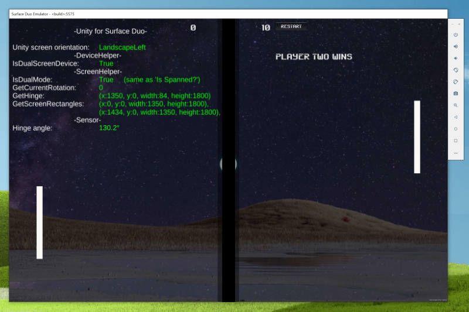

# Duo Pong

Tutorial for making a clone of the classic Pong game, using Unity, based on [unity-pong](https://github.com/ainc/unity-pong). Check out the tutorial on Awesome Inc U: [Unity Pong tutorial](https://www.awesomeincu.com/tutorials/unity-pong/).

By default the game will show with dual-screen device data overlaid to demonstrate how to access Surface Duo APIs:

To remove the text, comment out or delete the ScreenHelperInfo script from the MainCamera.

## Try it out

[Download and install the Surface Duo SDK and emulator](https://docs.microsoft.com/dual-screen/android/get-duo-sdk).